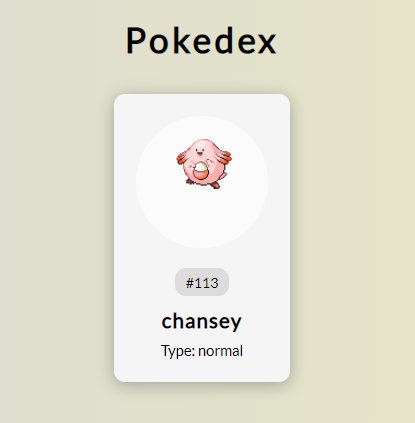

# Description



This application shows a pokemon consuming the following [this site - Poke API](https://pokeapi.co/).

The front end has been adapted from [this article](https://code-mentor.org/pokedex-project-in-javascript-with-source-code/).


# Prerequisites

- Terminal Linux(It is best indicated, if you don't, use bash 😀).
- python installed
- virtualenv installed (is important to facilitate the installation of the requested python packages)
- love for python🐍 💗

# Structure


```
.gitignore
Makefile  
requirements-dev.txt 
requirements.txt 
setup.py 
./pokedexN2t 
├── ext
│   ├── api 
│   │   ├── main.py
│   │   └── services
│   └──  site
│       ├── main.py
│       └── utils
├── static
├── template
└── app.py
```

modules:
- api -> routes and services
- site -> module that generates in the backend the frontend files
- static -> folder with static files
- template -> folder with html

files:
- app.py -> initial file

# Run

1. create a virtual env:
In the your path(linux)
```bash
virtualenv -p python3 ENV
source ENV/bin/activate
```

2. install dependencies:
```bash
make install
```

3. Run the project in dev:
```bash
make run-dev
```

what is expected in the terminal:

```bash
FLASK_APP=pokedexN2t/app.py FLASK_ENV=development flask run
 * Serving Flask app 'pokedexN2t/app.py' (lazy loading)
 * Environment: development
 * Debug mode: on
 * Running on http://127.0.0.1:5000/ (Press CTRL+C to quit)
 * Restarting with stat
 * Debugger is active!
 * Debugger PIN: 134-142-589
```
